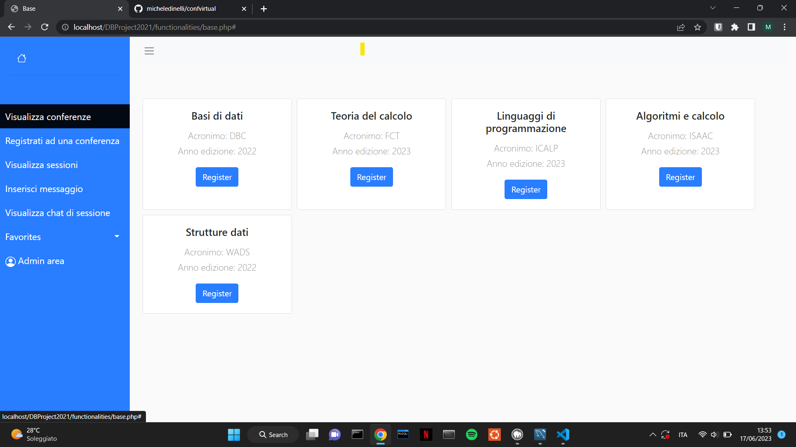
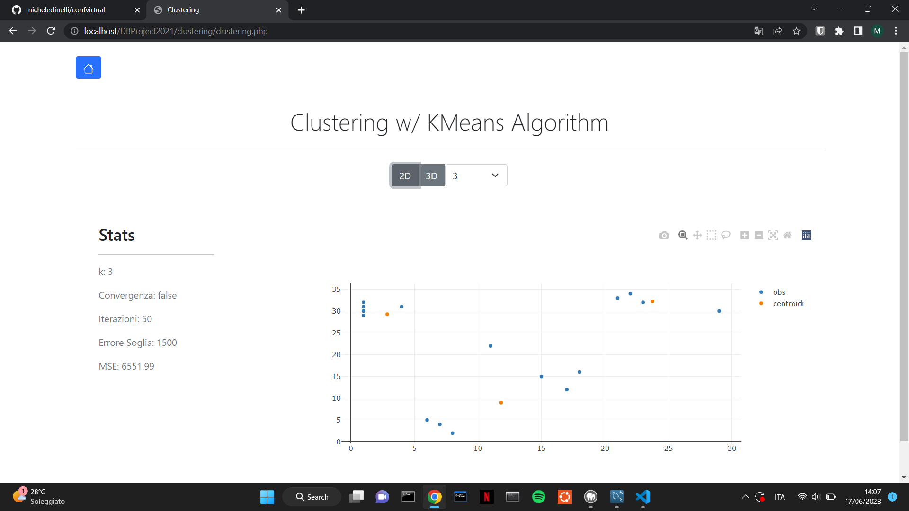
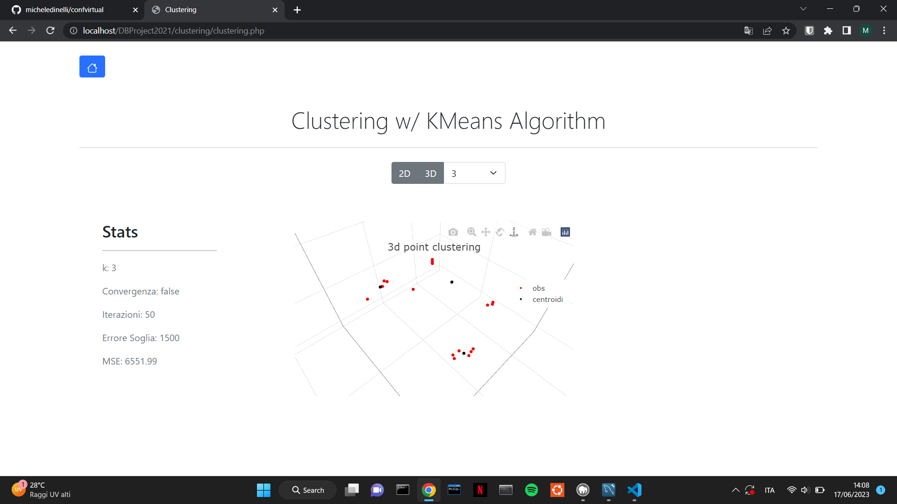

# CONFVIRTUAL

Confvirtual is a university project developed and mantained by sayonara team. 


## Project desription

Confvirtual is a platform to schedule virtual conferences, in order to organize and programm the events where the conferences are hosted. Users can register to the platform to follow the live chat of the conference, look through the events, dicsover the speakers and so on.

Confvirtual is made with plain PHP, HTML, CSS and JS. Needs an apache server to start and the core functionalities are programmed in MySQL stored procedures and triggers.

The database is the main actor of the project beacuse this was made for **Database course** at the University of Bologna (2020/2021).



## Install and run

Is reccomended to have MAMP install, in order to have Apache and MySQL Server on.

If MAMP is installed run ```git clone https://github.com/micheledinelli/confvirtual.git```

Once you've cloned the repository change the Apache directory in MAMP, choosing the directory were ypu cloned the project.

You're almost there! before running we suggest to run the scripts **./confvirtual.sql** and **./insertOperaions.sql** in a SQL client (like MySQL Workbench) connected to MySQL Server running on MAMP. We suggest this in order to have mock data and the db instance.

## Other infos

### Clustering

K-Means Algorithm has been implemented from scratch in vanilla JS, to clusterize users.
This feature supports both 2D and 3D visualization



